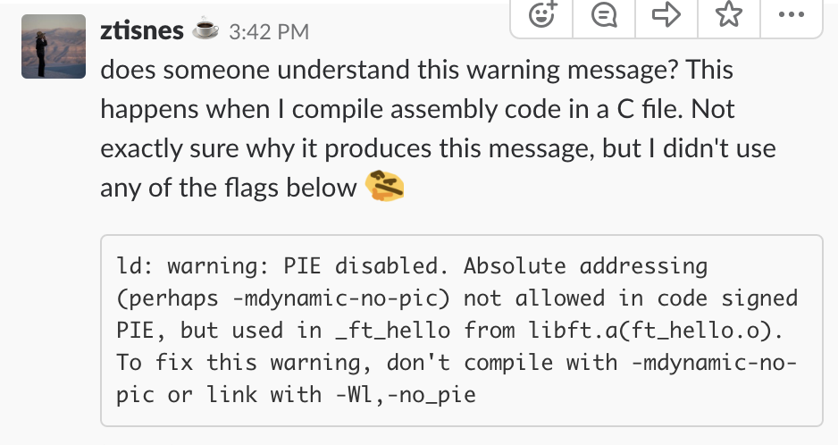
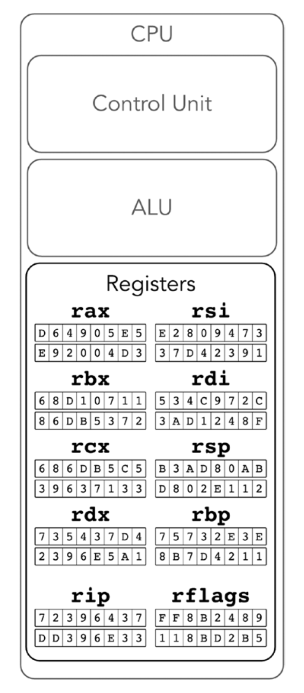

# Notes from "Low-Level Programming" C, ASM, and Program Execution on Intel 64 Architecture
by Igor Zhirkov

***
### Peer-peer experience / Q&A
Note from Adam:
> For anyone trying to learn ASM I’d suggest learning all the basics first, how stack/heap works, how program execution is tracked, registers and which are reserved and for what purpose, etc.
Then do ASM alone before diving into Inline ASM, it’ll make it a lot clearer 🙂

response from Kane:

>you're doing something in your asm that requires absolute addressing
remove that or use the PIE compatible version. Absolute address is constant address. relative address is variable address.

***

Things that I need to look up:

Endians

Cache

hit and miss

***

The ways that I write my notes is to make a similar concept in a real situation and interpret it for myself. This is, by far, the best way I can learn from concepts that are difficult to process. This process of learning is to make an analogy and it will be related to _Tom & Jerry_ series because is my favorite cartoon with malleable information to dissect.

***

**Computer architecture** is the structure of how computers works in a low scope level.
This brought features of a different understanding, which are:

* Memory stores in bits only.
* Memory is stored as a bit string - which is encoded with instructions and data to operate.
* Memory is organized into cells (a.k.a registers)
* Instructions run in a sequential order - meaning from top to bottom (unless you run special jump instructions).

A little of vocabulary before we moving on:
1. **Assembly Language:** Low-level language which retains memory information in a sequential machine language
2. **CPU (central processing unit):** execute instructions.
3. **ALU (arithmetic logic unit):** where magic happens; logic gates where it does basic operations in one execution.
4. **Registers:** cells placed on the CPU. They are faster to access on the circuit, complicated, and expensive. They are based from _transistors_, while main memory uses condensers.
5. **Hardware stack:** push and pop emulation with machine instruction and register
6. **Cache:**
7. **Hit and miss:**
8. **Virtual memory:** Abstraction of physical memory; helps distribute between programs in a safer and more effective way, and isolates programs from one another; memory storage supported by data as a secondary storage and transfer between physical addresses.
9. **Physical memory:** RAM lol
10. **Locality of reference:** (read below)
11. **Temporal locality:** accesses to one address are likely to be close in time.
12. **Spatial locality:** accessing an address X the next memory access will likely to be close to X.
13. **Protection rings:** Computer hardware privilege levels and computer security. The inner, the harder. The zero layer would be the kernel, ring 1 and 2 are device drivers, and ring 3 are applications.

**note**: Memory state and values of registers fully describe the Cpu state (from a programmer’s point of  view). understanding an instruction means understanding its effects on memory and registers.

There is a slight problem when it comes to ASM coding. **_do not try to multitask_** otherwise you will end up making multiple of bugs and there will be holes just like Tom [add inline GIF of Tom having leak problems].

CPU performance and memory are different for the system management in the long run. So, the way that engineers built the hardware in such a way, is to build a strong CPU that can process most of the memory to increase speed by choosing other types of underlying circuits.

**Okay, where is the Intel 64 you were talking about?**
Some computers are built in with Intel in it, some don't. If the computer is built with a different processor, then these notes are not good for you to follow along. The computer that I'm using has Intel, so we are good.

## Let's talk about registers...

Instruction have to be fetched from memory, operands have to be fetched from memory; store results in memory as well. Sounds like a complicated task, but is the beauty behind data exchanges. That is why there are memory cells. small and fast = speed overtime. There is a difference between CPU cache and registers. Registers allows faster access, which is encoded into opcode for ASM language.

Register -> few bytes long

Cache -> contains instruction code and store temporary copy of read or written data.

In the worst case scenario, register usage slows down computers if the memory are in a bottleneck. To make it better, they are saved for later and stored in a temporary allocated memory cells (virtual memory).

**Okay... what is the point then?**
Easy, this is how assembly programming works with registers.

The general purpose registers are interchangeable and can be used in many different commands. There are 64-bit registers.

| bit register  | alias         | functionality  				|
| ------------- |:-------------:| -------------: 				|
| `r0`          | `rax`         | accumulator    				|
| `r1`          | `rcx`         | used for cycles				|
| `r2`          | `rdx`         | stores data    				|
| `r3`          | `rbx`         | base register 				|
| `r4`          | `rsp`         | push top						|
| `r5`          | `rbp`         | stack's base			        |
| `r6`          | `rsi`         | src str[i] manipulation cmd	|
| `r7`          | `rdi`         | dst str[i] manipulation cmd	|
| `r8`          | `idfk`        |    $1          |
| `r9`...`r15`  | N/A           | $1600          |

**note: All instructions have different sizes!**

Because registers have different sizes, it is 8, 16, and 32 bits.

8 bits or lower = byte (**b**)

16 bits = word (**w**)

32 bits = double word (**d**)

**Use protection kids! (protection rings)**
Ring layers are used for protection of malware or fault capabilities. Each ring are a privilege level of security, and each **instruction type is linked with one or more privilege levels**.

**Hardware stacks**
The hardware stack is most useful to implement function calls in higher-level languages. When a function A calls another function B, it uses the stack to save the context of computations to return to it after B terminates.

**Important things before we jump to ASM coding**
	rdi -> file descriptor

	rsi -> buffer's address (where is the data going to be written out?)

	rdx -> number of bytes to be written

**How to run an ASM code?**
nasm -f macho64 foo.s -o foo.o
ld foo.o -o bar

**Python int/hex calculator**
python -c 'print(hex(0x20000))' then append the sys call
